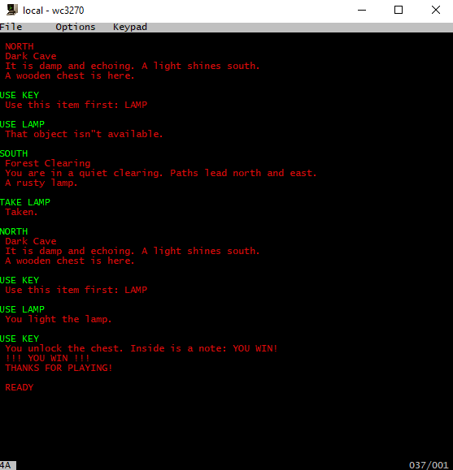

# COBOL Text Adventure Engine  
*Run interactive fiction on your PC or a 1960s-era IBM mainframe — in pure COBOL.*




A minimal, file-driven text adventure engine written in **COBOL-85** (GNUCOBOL) and **COBOL-74** (OS/360 MVT on TK4-). The same source runs identically on both platforms — only compilation differs.

The engine uses **only two data files**:
- `rooms.dat` – room topology, descriptions, **and game title**  
- `objects.dat` – object definitions with **built-in win logic and dependencies**

No external win file is needed — everything is embedded in the object records.

---

## 🌟 Key Features

- **4-directional movement**: `NORTH`, `SOUTH`, `EAST`, `WEST`  
- **Commands**: `LOOK`, `INVENTORY`, `INVT`, `QUIT`, `TAKE <object>`, `USE <object>`  
- **Smart object use**: An object can only be used if:  
  - It’s in the room or in your inventory  
  - You’re in the correct room (`OBJ-USE-ROOM`, or `00` for anywhere)  
  - Any required object has already been used (`OBJ-REQD-OBJ`)  
- **Win detection**: If `OBJ-IS-WIN = 'Y'`, using the object ends the game  
- **Dynamic title**: The first record in `rooms.dat` with `ROOM-NAME = 'TITLE'` sets the game’s title

---

## 🌲 Featured Story: *The Forest Adventure*

### Game Title
Defined in `rooms.dat`:


### Room Map
| ID | Name             | Description                                      | Exits (N,E,W,S) |
|----|------------------|--------------------------------------------------|-----------------|
| 00 | TITLE  | The Forest Adventure |
| 01 | Forest Clearing  | You are in a quiet clearing. Paths lead north and east. | N→02, E→03      |
| 02 | Dark Cave        | It is damp and echoing. A light shines south.    | S→01            |
| 03 | River Bank       | A fast river blocks your way east. A bridge lies north. | N→04            |
| 04 | Old Bridge       | The bridge creaks underfoot. A key lies here.    | S→03            |

### Objects (128-byte records)

| Name  | Location | Portable | Use Room | Requires | Win? | Description             | Use Message |
|-------|----------|----------|----------|----------|------|--------------------------|-------------|
| LAMP  | 01       | Y        | 00       | —        | N    | `"A rusty lamp."`        | `"You light the lamp."` |
| KEY   | 04       | Y        | 02       | LAMP     | Y    | `"A small brass key."`   | `"You unlock the chest. Inside is a note: YOU WIN!"` |
| CHEST | 02       | N        | —        | —        | N    | `"A wooden chest is here."` | *(not used directly)* |

> 🔑 **How to win**:  
> 1. `TAKE LAMP` → `USE LAMP` (anywhere)  
> 2. Go to room 04, `TAKE KEY`  
> 3. Go to room 02, `USE KEY` → win check passes → **YOU WIN!**

---

## 🎮 Included Adventures

| Folder      | Title                 |
|-------------|-----------------------|
| `forest`    | The Forest Adventure  |
| `tower`     | The Locked Tower      |
| `temple`    | The Sunken Temple     |
| `study`     | The Haunted Study     |

Each adventure is self-contained in its folder with `rooms.dat` and `objects.dat`.

---

## ▶️ How to Play

### On PC (GNUCOBOL)
```bash
cobc -x advent.cob
cd forest
../advent.exe
```


### On TK4- / Hercules (OS/360 MVT, COBOL-74)

1. **Transfer data files using IND$FILE** from your PC to TK4-:  
   - In the IND$FILE transfer dialog, set **File Type = `FIXED`**  
   - Specify the **exact record length**:  
     - `forest\rooms.txt` → `'USER.FOREST,ROOMS.DAT'` **(FIXED 128)**  
     - `forest\objects.txt` → `'USER.FOREST,OBJECTS.DAT'` **(FIXED 128)**  
   > 💡 Do this **once per dataset** — the LRECL is stored in the catalog.

2. The engine reads `ROOMS` and `OBJECTS` as fixed-length sequential files.

3. Use the included **CLIST** for pseudo-interactive play in **READY mode**:

```clist
/* USER.RUN.CLIST(RUNADV) */
PROC 1
PROC 1 GAME                                               
ALLOC FILE(ROOMS) DA('USER.&GAME..ROOMS.DAT') SHR       
ALLOC FILE(OBJECTS) DA('USER.&GAME..OBJECTS.DAT') SHR   
ALLOC FILE(SYSOUT) DA(*)                                  
ALLOC FILE(SYSIN) DA(*)                                   
CALL 'USER.RUN.LOAD(ADVENT)'                            
```

Run in MVS READY mode:

`EX 'USER.RUN.CLIST(RUNADV)' 'FOREST'` or  `EX RUN(RUNADV) 'FOREST'`


> 💡 The CLIST pre-allocates files and invokes the load module directly, enabling a conversational feel despite OS/360’s batch nature.
---


## 📏 File Formats (Fixed-Length Records)

### `rooms.dat` — 128 bytes per record
```cobol
05 ROOM-N-EXIT      PIC 99.
05 ROOM-E-EXIT      PIC 99.
05 ROOM-W-EXIT      PIC 99.
05 ROOM-S-EXIT      PIC 99.
05 ROOM-NAME        PIC X(20).
05 ROOM-DESC        PIC X(100).
```
> **Special**: First record with `ROOM-NAME = 'TITLE'` defines the game title (`ROOM-DESC` is the title text).

### `objects.dat` — 128 bytes per record
```cobol
05 OBJ-NAME         PIC X(10).
05 OBJ-LOCATION     PIC 99.
05 OBJ-PORTABLE     PIC X.
05 OBJ-TAKEN        PIC X.
05 OBJ-USED         PIC X.
05 OBJ-REQD-OBJ     PIC X(10).   *> Blank = no requirement
05 OBJ-USE-ROOM     PIC 99.      *> 00 = usable anywhere
05 OBJ-IS-WIN       PIC X.       *> 'Y' = win when used
05 OBJ-DESC         PIC X(40).   *> Shown in LOOK/INVENTORY
05 OBJ-USE-MSG      PIC X(60).   *> Shown when successfully used
```

> All files are **flat, ASCII-encoded, and contain no line feeds**.

---

## 🛠️ Editing Stories

Use the included PowerShell tools to convert between fixed-block and editable text:

```powershell
# To edit
.\dat2txt.ps1 rooms.dat 128
.\dat2txt.ps1 objects.dat 128

# After editing
.\txt2dat.ps1 rooms.txt 128
.\txt2dat.ps1 objects.txt 128
```

---

## 📜 License

Public domain. Written in the spirit of retro computing and COBOL preservation.

> “It’s not legacy — it’s **vintage engineering**.”

— manny juan
```
